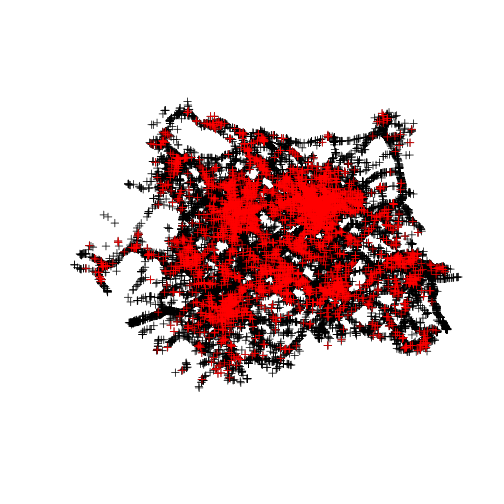
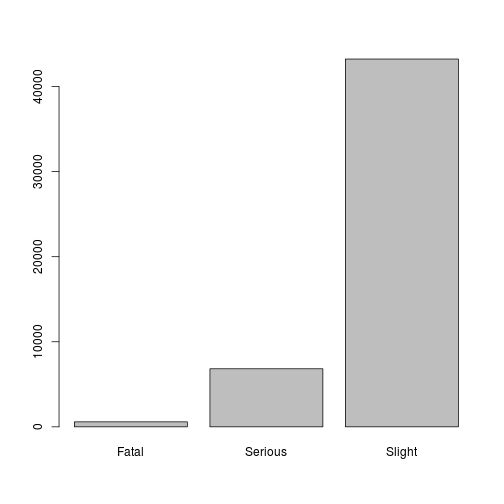
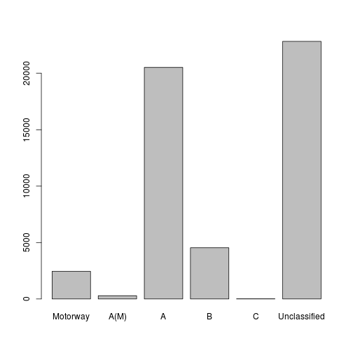

# Adding factors

```r
load("../geodata/WYall.RData")

# Compare bike crashes with others + generalise results

bikes <- vtWY$Acc_Index[vtWY$Vehicle_Type == 1]
acB <- acWY[acWY$Accident_Index %in% bikes, ]
```

```
## Loading required package: sp
```

```r
vtB <- vtWY[vtWY$Acc_Index %in% bikes, ]
caB <- caWY[caWY$Acc_Index %in% bikes, ]


plot(acWY)
plot(acB, col = "red", add = T)
```

 

```r

library(XLConnect)
```

```
## XLConnect 0.2-7 by Mirai Solutions GmbH
## http://www.mirai-solutions.com ,
## http://miraisolutions.wordpress.com
```

```r
library(rJava)
wb <- loadWorkbook("../Road-Accident-Safety-Data-Guide-1979-2004.xls")
wb <- readWorksheet(wb, sheet = getSheets(wb))
names(wb) <- sub(" ", ".", names(wb))
names(wb) <- sub(" ", ".", names(wb))
names(wb) <- sub("1", ".", names(wb))
names(wb)
```

```
##  [1] "Introduction"                "Export.Variables"           
##  [3] "Police.Force"                "Accident.Severity"          
##  [5] "Day.of.Week"                 "Local.Authority.(District)" 
##  [7] "Local.Authority.(Highway)"   ".st.Road.Class"             
##  [9] "Road.Type"                   "Junction.Detail"            
## [11] "Junction.Control"            "2nd.Road.Class"             
## [13] "Ped.Cross.- Human"           "Ped.Cross.- Physical"       
## [15] "Light.Conditions"            "Weather"                    
## [17] "Road.Surface"                "Special.Conditions.at Site" 
## [19] "Carriageway.Hazards"         "Urban.Rural"                
## [21] "Police.Officer.Attend"       "Vehicle.Type"               
## [23] "Towing.and.Articulation"     "Vehicle.Manoeuvre"          
## [25] "Vehicle.Location"            "Junction.Location"          
## [27] "Skidding.and.Overturning"    "Hit.Object.in Carriageway"  
## [29] "Veh.Leaving.Carriageway"     "Hit.Object.Off Carriageway" 
## [31] ".st.Point.of Impact"         "Was.Vehicle.Left Hand Drive"
## [33] "Journey.Purpose"             "Sex.of.Driver"              
## [35] "Age.Band"                    "Vehicle.Propulsion.Code"    
## [37] "Casualty.Class"              "Sex.of.Casualty"            
## [39] "Casualty.Severity"           "Ped.Location"               
## [41] "Ped.Movement"                "Car.Passenger"              
## [43] "Bus.Passenger"               "Ped.Road.Maintenance Worker"
## [45] "Casualty.Type"               "IMD.Decile"                 
## [47] "Home.Area.Type"
```

```r


# Let's see which data need to become factors (1st for cyclists in WY, then
# everywhere): summary(ac)
acB$Accident_Sf <- factor(acB$Accident_Severity, labels = wb$Accident.Severity$label)
plot(acB$Accident_Sf)
```

 

```r
summary(acB$Accident_Sf)
```

```
##   Fatal Serious  Slight 
##     590    6825   43241
```

```r

# Police force
summary(acB$Police_Force)
```

```
##    Min. 1st Qu.  Median    Mean 3rd Qu.    Max. 
##       4      13      13      13      13      14
```

```r
acB$Police_Ff <- factor(acB$Police_Force, labels = wb$Police.Force$label[1])  # Not tested on full dataset
summary(acB$Police_Ff)
```

```
## Metropolitan Police1 Metropolitan Police2 Metropolitan Police3 
##                    1                    2                50626 
## Metropolitan Police4 
##                   27
```

```r
plot(acB$Police_Ff)
```

 

```r

head(wb$.st.Road.Class)
```

```
##   code        label
## 1    1     Motorway
## 2    2         A(M)
## 3    3            A
## 4    4            B
## 5    5            C
## 6    6 Unclassified
```

```r
summary(acB$X1st_Road_Class)
```

```
##    Min. 1st Qu.  Median    Mean 3rd Qu.    Max. 
##    1.00    3.00    4.00    4.34    6.00    6.00
```

```r
acB$X1st_Road_Cf <- factor(acB$X1st_Road_Class, labels = wb$.st.Road.Class$label)
summary(acB$X1st_Road_Cf)
```

```
##     Motorway         A(M)            A            B            C 
##         2454          289        20524         4538           18 
## Unclassified 
##        22833
```

```r
plot(acB$X1st_Road_Cf)
```

 

