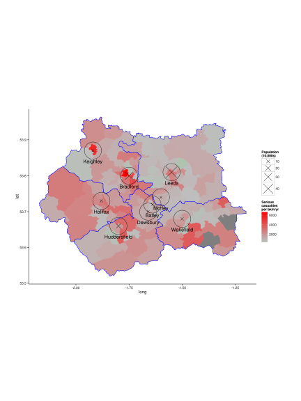
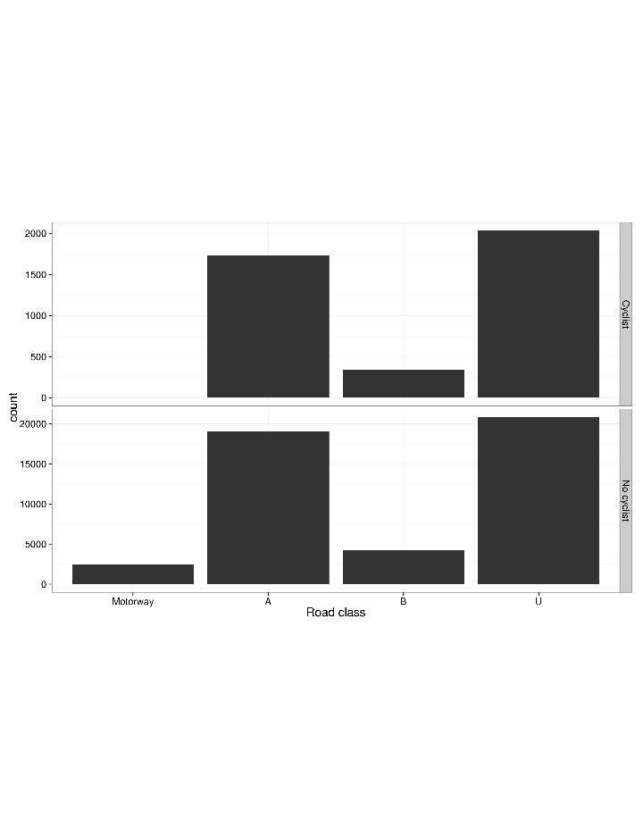

# Adding factors

```r
library(XLConnect)
library(rJava)
wb <- loadWorkbook("Road-Accident-Safety-Data-Guide-1979-2004.xls")
```

```
## Error: FileNotFoundException (Java): File
## 'Road-Accident-Safety-Data-Guide-1979-2004.xls' could not be found - you
## may specify to automatically create the file if not existing.
```

```r
wb <- readWorksheet(wb, sheet = getSheets(wb))
```

```
## Error: error in evaluating the argument 'sheet' in selecting a method for function 'readWorksheet': Error in (function (classes, fdef, mtable)  : 
##   unable to find an inherited method for function 'getSheets' for signature '"list"'
```

```r
names(wb) <- sub(" ", ".", names(wb))
names(wb) <- sub("1", ".", names(wb))


# Let's see which data need to become factors (1st for cyclists in WY, then
# everywhere): summary(ac) ac$Accident_Sf <- factor(ac$Accident_Severity,
# labels = wb$Accident.Severity$label)
plot(ac$Accident_Sf)
```

 

```r
summary(ac$Accident_Sf)
```

```
##   Fatal Serious  Slight 
##   18116  181742 1155757
```

```r

# Police force summary(acB$Police_Force) ac$Police_Ff <-
# factor(ac$Police_Force, labels = wb$Police.Force$label) # Not tested on
# full dataset
summary(ac$Police_Ff)
```

```
##   Metropolitan Police               Cumbria            Lancashire 
##                191341                 12179                 38169 
##            Merseyside    Greater Manchester              Cheshire 
##                 29015                 53894                 26523 
##           Northumbria                Durham       North Yorkshire 
##                 31557                 12233                 18867 
##        West Yorkshire       South Yorkshire            Humberside 
##                 50640                 30861                 21235 
##             Cleveland         West Midlands         Staffordshire 
##                  8670                 57692                 27963 
##           West Mercia          Warwickshire            Derbyshire 
##                 24365                 13677                 24238 
##       Nottinghamshire          Lincolnshire        Leicestershire 
##                 26500                 19072                 22305 
##      Northamptonshire        Cambridgeshire               Norfolk 
##                 12174                 22121                 16884 
##               Suffolk          Bedfordshire         Hertfordshire 
##                 15890                 13034                 25071 
##                 Essex         Thames Valley             Hampshire 
##                 36577                 50300                 41013 
##                Surrey                  Kent                Sussex 
##                 33819                 41126                 36449 
##        City of London    Devon and Cornwall     Avon and Somerset 
##                  2714                 39359                 34498 
##       Gloucestershire             Wiltshire                Dorset 
##                 11266                 12723                 17331 
##           North Wales                 Gwent           South Wales 
##                 14381                  7816                 25028 
##           Dyfed-Powys              Northern              Grampian 
##                 12695                  5348                  9205 
##               Tayside                  Fife   Lothian and Borders 
##                  6961                  4570                 19558 
##               Central           Strathclyde Dumfries and Galloway 
##                  4910                 38586                  3212
```

```r
plot(ac$Police_Ff)
```

 

```r

# summary(ac$X1st_Road_Class) ac$X1st_Road_Cf <- factor(ac$X1st_Road_Class,
# labels = wb$.st.Road.Class$label)
summary(ac$X1st_Road_Cf)
```

```
##     Motorway         A(M)            A            B            C 
##        53257         3543       612282       172868       121542 
## Unclassified 
##       392123
```

```r
plot(ac$X1st_Road_Cf)
```

 

