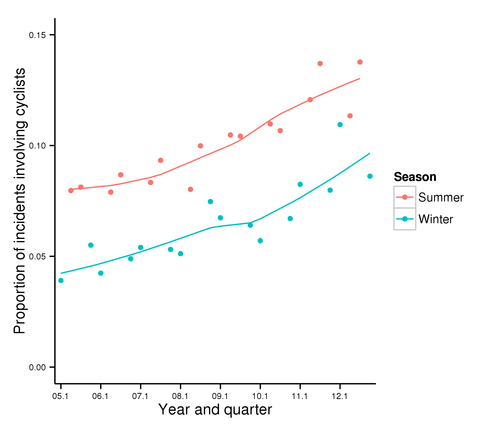
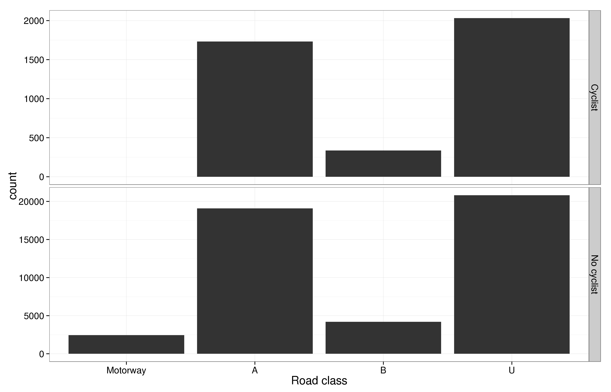
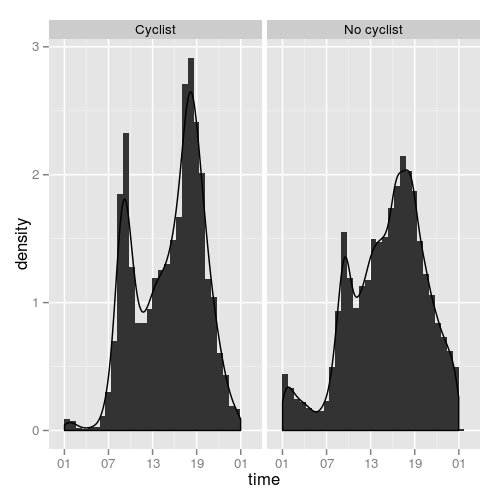
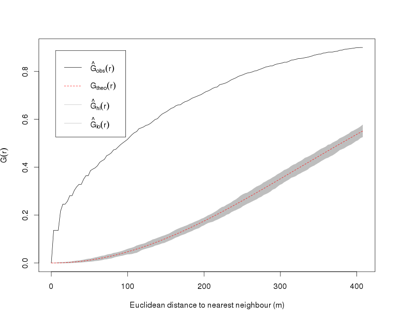

# The shifting demographic and geographic distribution of bicycle crashes: a case study of West Yorkshire

```{r, echo=FALSE}
# Social and geographical factors linked with bicycle incidents: a case study of West Yorkshire
# TODO RL: find correlation between growth in rate of accidents and rate of cycle to work
# TODO RL: estimate exposures from Census and NTS data
# TODO IK: writing; add references yet to be included
```

References to include:

- ([Schepers, 2012](http://injuryprevention.bmj.com/content/18/4/240.abstract))
- (Elvik et al., 2009)
- ([Short and Caulfield, 2014](http://www.sciencedirect.com/science/article/pii/S0967070X14000699))
- ([Wegman et al., 2012](http://www.sciencedirect.com/science/article/pii/S0001457510003416))
- ([Parkin et al., 2007](http://www.sciencedirect.com/science/article/pii/S0001457506001473))


## Abstract

There has been much recent interest in the factors influencing cycle safety.
Within this broad topic, international differences in accident
and mortality rates, protective equipment and bicycle training have
received particular attention. Within this reseach body there
is a growing interest in environmental factors, but few studies have
focussed on geographical factors at the local level.
This paper addresses this research gap by analysing a geo-referenced
dataset of bicycle accidents, taken from the UK's STATS19 dataset
(2005 - 2012). We investigate incidents involving cyclists
within the case study area of West Yorkshire, an area that
has a historically low cycling rate but very high ambitions
following investment to promote cycling in the area.
Descriptive statistics and statistical tests are used to identify
the characteristic features of bicycle incidents and how they
differ, on average, from other types of crashes.
Spatial statistics are used to characterise the
distribution of injuries to cyclists, allowing inferences about
the relative risks associated with various geographically distributed
features such as roundabouts, junctions, one-way streets, speed limits and cycle paths.
Temporal analysis identifies how these geographical risk factors intersect
with time of day, week and season. Overall we provide evidence to suggest
local-level geographical factors do play an important role in cycle safety
and provide suggestions of how to increase cycle safety and uptake nationwide.


# Introduction

Fear of death or serious injury when walking and cycling is a
major barrier to uptake (Fishman et al., 2012; Lorenc et al., 2008).
Research strongly suggests that the health benefits of modal shift
to cycling greatly outweigh the risks, with
health benefit:cost ratios estimated to be
7:1 in the Netherlands (de Hartog et al., 2010),
20:1 in the UK (Hillman, 1993) and
more than 70:1 at the city level in Barcelona (Rojas-Rueda et al., 2011).

Despite overhelming evidence of health benefits
of active travel, use of walking and cycling for
everyday trips remains low in most high income nations.
The average number of miles walked per
person per year in Great Britain, for example, has declined from 201 in 2003 to
181 in 2012 ([DfT, 2013](https://www.gov.uk/government/publications/national-travel-survey-2012)).
While the number of miles cycled per person
appears to have increased over the same period - from 37 to 53 miles (ibid.) - perhaps due
to a boom in leisure cycling),
bicycles still account for only 1.7% (up from 1.4% in 2007) of all journeys in
Great Britain and 0.8% of all distance travelled 
(ibid.,
tables NTS0301 to NTS303).
This is despite the fact that the fact that roughly
2/3rd of all trips of were within cycling distance (between 0 and 5 miles)
in 2012 (ibid, table NTS0307).
<!--*footnote{Also, 38% of all trips
were between 0 and 2 miles, easily accessible for cyclists of all abilities
(DfT, table NTS0307). It is interesting to note that the proportion
of trips made for short journeys (less than 5 miles) has declined over the past
two decades, from 69.8% in 1995/7 to 65.8% in 2012. The time series
data suggests this trend has stopped since the
recession (with a minimum of 65.2% reached in 2007),
providing some evidence of an 'eco-localisation'
to energy and economic shocks 
([North, 2012](http://www.sciencedirect.com/science/article/B6V68-4WFGRTK-1/2/0c6fed0baa6b8baafa205e74135b66f1))}*.-->
In terms commuting, for which the best data are available,
the proportion of people using a bicycle as their primary mode
has remained steady at just over 3% across England (Goodman, 2013).
This masks substantial geographical variation, however: outside
London, bicycle commuting in England has actually
declined, from 3.2% in 2001 to 2.9% in 2011 (Lovelace, forthcoming).

In the recent Annual Report of the UK's Chief Medical Officer,
Dame Sally Davies emphasised the need to promote active
travel from a health perspective:
"encouraging more people to engage in active travel,
such as walking and cycling, is crucial to improving the
health of the nation and reducing the prevalence of obesity"
(Davies, 2014, p.16). 
Still, fear of cycling is not completely without basis,
especially for young people cycling in dangerous environments.
Compared with travelling the same distance by car,
the risk of death from travelling one kilometre on foot
or by bicycle is more than 17 times higher (Davies, 2014).
The geographical distribution of
factors linked to cycling uptake, such as perceived and actual
safety levels has powerful policy implications,
yet has received little academic attention (Fraser and Lock, 2011).

<!--of this health cost:benefit ratio - which will also be affected by air polution levels-->

Safety is increasingly seen as critical to the uptake of
cycling:
"In order to improve uptake, we need to improve safety.
The relative risk associated with journeys by active travel
methods are unacceptably high and must be reduced ...
An  improved understanding of methods to improve road safety
for all modes of transport and how these can be applied to
the road system in England would be beneficial." (Davies, 2014; p16-17).
This paper builds on this observation
and seeks to provide evidence towards greater understanding
of the risks of active travel.

## The case study area

West Yorkshire is not an area associated with cycling.
Although the cities of York and Hull have traditionally high rates of
cycling, Leeds and Bradford have historically low levels of active travel 
and heavily car orientated urban plans.
In recent years there have been efforts to ammend this situation,
and even calls for Leeds (traditionally known as the 'Motorway city')
to become a 'cycling city'. This aspiration received a boost with the
publication of 2011 census data showing that Leeds has seen cycling
grow substantially (by 0.5 percentage points), from 1.4% to 1.9% in 2011.
To put this growth in the national context,
Leeds ranks 34th out of all 324 Enlgish Local Authorities
in terms of cycling and 13th when London is excluded.
In terms of Northern cities, Leeds has seen the fourth
greatest shift to cycling, trailing only Newcastle, Manchester and Sheffield.
Unfortunately, cycling has declined in the other Local Authorities within
West Yorkshire, leading to a highly uneven spatial distribution of
cycling across the county (figure 1).

West Yorkshire is a metropolitan county containing almost 1 million inhabitants
() in an area of xx km2. It thus has a relatively high population density of xx people
per km2, unevenly distributed between the 5 Local Authorities of
Leeds, Bradford, Wakefield, Calderdale and Kirklees that make up the area.
The vast majority of the population is urban, although West Yorksire
also contains tracts of countryside in the form of the Yorkshire Dales to the North
and the
majority of Calderdale and Kirklees to the West (figure 1).

```{r fig.cap="Overview of the study area", fig.width=10, fig.height=13, echo=FALSE}
library(png)
library(grid)
img <- readPNG("figures/wy-overview.png")
 grid.raster(img)
# 
```

- Tour de France
- Targets for 10% of trips to be by bike following City Connect (WYCA)
- Definition of a crash as something reported in the STAT19 dataset. What is this specifically?

In terms of geographical research into cycling, there has been much work on the
factors associated with the prevelance of bicycle use (e.g.
[Buehler](http://www.mautc.psu.edu/docs/VT-2009-05.pdf)). Much less has been written
on the determinants of crashes involving cyclists and cyclist's fear of using the road.
These are important oversights because safety concerns have been found to be
the predominant cycling deterrent
([Fishman et al., 2012](http://linkinghub.elsevier.com/retrieve/pii/S1369847812000733);
ref Ann Jopson on this...). Thus it is fear of poor
health via accidents which, perversly, prevents cyclists
from enjoying the health benefits of cycling: health benefits
are consistently found to outweigh the costs of cycling,
especially for elderly people who benefit disproportionately from cycling
(ref...)

## Hypotheses

The hypotheses tested in this project were based on the
literature on cyclist safety and fall into three broad
categories: who, where and when.

A conceptual framework for developing hypotheses and
inteventions around road safety was provided by 
Schepers et al. ([2014](http://www.sciencedirect.com/science/article/pii/S0001457513001309))...

### Who is most at risk from cycle incidents?

- Young adults (below 30) and the elderly (over 65) will be more likely to be involved in crashes
([Martinez-Ruiz et al., 2014](http://www.sciencedirect.com/science/article/pii/S0001457513004089)).
We expected this trend to be stronger in more challenging cycling environments, on large roads.

### Where are crashes most likely to happen?

- We expected unusual and challenging features of
urban infrastructure to be associated with higher than average rate of
cycling than the rest of the road network. Following
([Vandenbulcke et al., 2014](http://www.sciencedirect.com/science/article/pii/S0001457513002686),
we specifically expected clusters of incidents
surrounding on-road tram tracks, bridges without cycling facilities,
complex intersections and areas with a high traffic volume.
Also based on this work, we expected cycle infrastructure to reduce risk.
- 

### When are bicycle crashes most likely

- We expect absolute levels of cycle incidents to have remained steady
over time, in line with statistics on the number bicycle commuters
in West Yorkshire overall.
- However, areas with the highest rates of cycling were expected to have
the lowest incident rate per
unit exposure. This is based on 'strength in numbers', hypothesis that it will be
relatively safer to cycle in areas with a large number of commuters. This hypothesis
has received empirical support from the geographical literature on the subject
([Vandenbulcke et al., 2009](http://linkinghub.elsevier.com/retrieve/pii/S0967070X09000407)).
- Seasonal variability of traffic accidents for cyclists was expected
be different than for other road users, due
to the disproportionate impact of poor road conditions and visibility (ref).
- The diurnal distribution of incidents was expected to
be different for cyclists than for other road users ([Twisk and Reurings, 2013](http://www.sciencedirect.com/science/article/pii/S0001457513003278)).


<!--## Literature review: the spatial distribution of cycle accidents-->

# The data

The dataset for this study is the National STATS19 data on road traffic incidents.
The data reports all incidents that took place between the 1st January 2005 until the 31st
December 2012, providing 8 years of uninterrupted records.
The structure of the raw dataset is itself quite complicated, divided into three main
files: 

- Accidents0512.csv, a 178 Mb file containing 1.3 million rows of data on the key attributes of each
incident, including time and data, location (Easting and Northing is 
provided in OSGB1936 coordinates to the nearest 1 m,
but rounded to the nearest 10 m in most cases), road type and other contextual variables
such as weather.
- Casualty0512.csv, a 74 Mb file containing 1.8 million rows on the attributes of casualties from
the incidents. These include reference to the vehicle, accident and socio-demographic
information about those injured.
- Vehicles0512.csv, a 142 Mb file containing 2.5 million rows of
data about the registered vehicles involved
in the incidents. Variables include vehicle type and other vehicle attributes demographic
details of the driver.

<!--Major updates to the structure of STATS19 data were made in 1992, when the-->

The variables of particular use for this study are summarised in Table xx below.
Henceforth, variables from these key variables will be referred to in the short form
allocated to them.

In terms of geographic data, the bulk of the analysis was conducted only on
accidents that occured within the case study zone of West Yorkshire (fig. x).

# Method

The analysis strategy was based on consideration of the
data and the hypotheses we were aiming to test.

## Estimating exposure
A major methodological challenge faced by anyone
trying to draw conclusions from road incident data
is that the underlying level of exposure is usually unknown.
Therefore, researchers can rarely tell if increases
in crashes are due to change in the riskiness of an
activity or whether simple increases in exposure - in
this case an increase in cycle use in particular areas -
is to blame.

The method used to estimate exposure varied depending on
the hypothesis being tested. In terms of where people cycle,
the best small-area data available is from census data on
mode of travel to work. Because of the finding that commute
modal share for cycling is highly correlated with modal share for
all trips (r = 77%) (Goodman, 2013), commuting can be used as
a proxy for the rate of cycling overall.
Based on this insight,
we developed a simple formula to estimate the distance cycled
in each geographic zone (equation xx1):

$$ d_T = \frac{n \times f \times \bar{d}}{p} $$

```{r, echo=FALSE, eval=FALSE}
400 * 4.2 * 3
400 * 4.5 * 3
```

where $d_T$ is the total distance cycled per year in each zone,
$n$ is the number of bicycle commuters, $f$ is the frequency
$\bar{d}$ is the average distance of each bicycle trip (which we assume to
be the same for commuting and non-commuting trips) and $p$ is the proportion
of bicycle trips made for commuting purposes.
To convert the number of
people cycling to work into an estimate of total distance cycled per
year, the following assumptions were made:

- 400 one-way trips are made each year per commuter (Hall et al., 2011).
- The average length of bicycle trips is 4.5 km (DfT, 2013, table NTS0306).
(The average trip length of bicycle trips from 2005 to 2012
was 2.8 miles - 4.5 km - although this average value is has been increasing lately (Keep, 2013).)
- Cycle commuting accounts for 1/3 of all bicycle trips (DfT, 2013, table NTS0409).
(British citizens make on average 15.6 bicycle trips per year, of which an average of 5.4 are for commuting.)

These assumptions imply that every bicycle commuter in an area,
results in 5,040 km of total distance cycled,  
1/3 of which are due to bicycle commuting.
This first approximation will clearly change depending on variation
in the average distance of bicycle trips in different areas, so is used
only as a first approximation than as a best estimate.
The refinement of this estimate based on data on distance
bands of travel to work by mode would be possible, but
for the purposes of this study, the average 5400 km/yr per cycle commuter will
be used for all areas. Further
work investigating the link between cycle commuting and cycling overall
is needed, to better infer the latter from the former for small areas (Goodman, 2013).

# Results

## Basic statistics cycle accidents in South Yorkshire

Over the entire study period, the proportion of accidents involving cyclists was 8.1%,
below the national average of 10.4%.
These figure mask great variability in time and space.

The most startling temporal trend in the data
was the near-continuous increase in the proportion of
incidents involving cyclists in West Yorkshire (Figure x).
Between 2005 and 2012, the proportion of reports involving
cyclists increased, from 6% to just over 10% of all incidents.
This trend mirrors the
national data and may be accounted for by increased uptake of cycling compared
with stagnating or declining distance travelled by other modes.

There was clear seasonal pattern in the data, with a
predominance of bicycle incidents during the
summer months, presumably due to the increased uptake of cycling in
warm and sunny weather (ref).
Dividing the year into 4 quarters, it was found that the summer months
(from April until September) were associated with a relatively high proportion
of incidents involving cyclists (10.1% on average),
compared with the colder half of the year (6.4%).


```{r fig.cap="Map illustrating the mismatches between 2011 Local Authorities and 2001 Unitary Authorities and Districts", fig.width=10, fig.height=13, echo=FALSE}
library(png)
library(grid)
img <- readPNG("figures/seasonalityWY.png")
 grid.raster(img)
# 
```

## Who is most at risk?


## Where are crashes most likely to happen?

The overall spatial distribution of incidents involving cyclists
follows the road network, as do incidents with no cyclist casualties (fig. x).
The relative density of cyclist crashes is clearly higher in urban centres,
however, and is clearly absent from the motorway network.
The extent to which bicycle crashes are concentrated in urban areas,
and especially Leeds, becomes clear when Kernel Density Estimate (KDE)
levels are used to avoid the information loss associated with 'overplotting'
(Wickham, 2011). This is presented in fig x, which shows the extent of
the clustering of incidents involving cyclists. Of course, this pattern
likely reflects the increased use of bicycles in Leeds city centre in
other places (Fig. 1). This pattern sets the scene for the
geographically aggregated statistics presented below,
which normalise the number of bicycle incidents in
each area by estimated exposure.

```{r, echo=FALSE}
# based on equation x!!! - link to equaiton above
```

```{r fig.cap="Overview of the spatial distribution of accidents with cyclists and no cyclists involved", fig.width=10, fig.height=13, echo=FALSE}
library(png)
library(grid)
img <- readPNG("figures/overview2.png")
 grid.raster(img)
```


```{r fig.cap="Kernel Density Estimates for incidents involving cyclists (left) and no cyclists (right)", fig.width=10, fig.height=13, echo=FALSE}
library(png)
library(grid)
img <- readPNG("figures/kdePlot.png")
 grid.raster(img)
```

### Normalised risk

```{r, echo=FALSE}
# Correlate with road type!!!
# Table of total n. crashes vs inferred risk for each area -> map
# 742675 * 5400 / 1000000000
# 12706 * 5400 / 1000000
# 57.1 / 51.0
# `r round(3.1 * 1.61, 1)`

# conversion of cyclists to death rate
# (ndeath/yr) / ((ncycle * distance/p) / 1000000000) 
# (919/8) / (742675 * 5400 / 1000000000)
# (19924/8) / (742675 * 5400 / 1000000000)
# (297/8) / (6352 * 5400 / 1000000000)
```

The total distance cycled in West Yorkshire was estimated to be
69 million km, based on the fact that there were 12,706 cycle commuters
recorded in the 2011 Census and equation xx1. To corroborate this estimate,
the same method was used at the national level, resulting in an estimate of
4.0 billion vehicle kilometres (bkm) across England (there are 742,675 cycle commuters nationwide):
it is reassuring to note that the DfT's official estimate of total distance cycled
nationally is of the same order - 5.0 bkm (Keep, 2013). Note the official
estimate is for Great Britain, whose population is 12% greater than that of England.
In terms of estimated risk of cycling, our estimate of 621 serious injuries per bkm cycled
is also close to the official estimate of 623, presented as 1005 injuries per billion vehicle *miles*
in Keep (2013).

Based on the census data and geographically aggregated statistics on serious
cyclist injuries and fatalities, the relative risk of cycling was calculated
for West Yorkshire's 5 Local Authorities (Table x):

Table x: Summary statistics on cycle commuting, serious and fatal cyclist incidents
and inferred risk in deaths and serious injuries per billion kilometres cycled (D/bpk/yr and
S/bpk/yr respectively).

|NAME        |  N. Cycle|       % Cycle|  N. Serious|  N. Death|    mkm/yr|  D/bpk/yr|  S/bpk/yr|
|:-----------|--------:|------------:|----------:|--------:|----------:|-----------:|-------------:|
|Bradford    |     1715|          0.8|        136|        6|      9.2|    81|      1835|
|Calderdale  |      903|          1.0|         81|        3|      4.9|    77|      2076|
|Kirklees    |     1829|          1.8|        123|        3|     9.9 |    38|      1556|
|Leeds       |     6352|          1.9|        297|        8|     34.3|    29|      1082|
|Wakefield   |     1907|          1.3|        116|        7|      10.3|    85|     1408|
|*England*   |  *742675*|     *3.1*|      *19924*|      *919*|    *4,010*|     *29*| *621*|      

In Table x above, note that although Leeds has the highest number overall cyclist casualties
(and second highest number of casualties per capita), the results suggest it is a comparatively
safe place to cycle in the context of West Yorkshire. All areas are more risky
than the national average in terms of serious injury rates per estimated distance cycled.
Calderdale, the Local Authority with the worst yearly
serious injury rate (`r round((81/8) / .903 , 1)` serious injuries
per 1000 cycle commuters) performs more than 3 times
worse than the national average in this metric.

At a lower level of geographical aggregation - ...


### Road type

In terms of the type of roads where accidents involving cyclists
occur, the proportions are roughly the same, except no cyclists
were involved Motorway incidents, which is hardly surprising
as cycling on Motorways is illegal (fig. x).
Of note was the high proportion of bicycle incidents
happening on (fast) A roads (42.3%), greater than the proportion
of other incidents happening on these roads (41.0%).
Given that that A roads constitute only a fraction
of all roads and the tendency of cyclists to avoid busy roads,
this finding suggests that cycling on A roads in West Yorkshire is
comparatively high risk activity: 
Assuming that 30% of on-road cycling takes place on A-roads,
this would imply that cyclists are `r round(41/30 * 100) - 100`% more likely
to be involved in a crash on A roads than on other types of road.
(Local survey data on
the types of road where people cycle by distance would be needed
to verify the 30% figure: if cyclists heavily avoid A roads, as can be
expected, the relative risk could be much higher in West Yorkshire.)
Indeed, this finding is supported by national statistics showing that
the *serious* injury rate for cyclists on A roads (2,407 per
billion miles cycled) is more than double the rate for cycling on all road
types (1,005) ([Keep, 2013](http://www.parliament.uk/briefing-papers/SN06224.pdf)).

<!--Could talk about deaths here also...-->

```{r fig.cap="Number of road incidents in West Yorkshire with cyclists (top) and no cyclists (bottom) involved by road class", fig.width=10, fig.height=13, echo=FALSE}
library(png)
library(grid)
img <- readPNG("figures/roadClass.png")
 grid.raster(img)
# 
```


## The timing of bicycle accidents

The temporal distribution of bicycle accidents is highly correlated with that of 
road accidents overall (correlation).
However, bicycle accidents have a much 'peakier' distribution 
that all road traffic accidents, with the accident density during the afternoon
rush hour almost 50% higher for cyclists than non cyclists (fig. x).



# Season


## Spatial statistics

<!---->

## Point-line analysis

## Aspatial characteristics of cycle accidents (vs other roads accs)

## Spatial relationships

# Discussion and conclusions


# References

Buehler, R. (2012). Determinants of bicycle commuting in the Washington, DC region: The role of bicycle parking, cyclist showers, and free car parking at work. Transportation Research Part D: Transport and Environment, 17(7), 525–531.

Davies, S. (2014). Annual Report of the Chief Medical Officer, Surveillance Volume, 2012: On the State of the Public’s Health. London. Retrieved from https://www.gov.uk/government/publications/chief-medical-officer-annual-report-surveillance-volume-2012

DfT. (2013). National Travel Survey 2012 (pp. 1–25). Department for Transport. Retrieved from https://www.gov.uk/government/uploads/system/uploads/attachment_data/file/243957/nts2012-01.pdf

Elvik, R., Vaa, T., Erke, A., & Sorensen, M. (2009). The handbook of road safety measures. Emerald Group Publishing.

Fishman, E., Washington, S., & Haworth, N. (2012). Barriers and facilitators to public bicycle scheme use: A qualitative approach. Transportation Research Part F: Traffic Psychology and Behaviour, 15(6), 686–698. doi:10.1016/j.trf.2012.08.002

Fraser, S. D. S., & Lock, K. (2011). Cycling for transport and public health: a systematic review of the effect of the environment on cycling. European Journal of Public Health, 21(6), 738–43. doi:10.1093/eurpub/ckq145

Goodman, A. (2013). Walking, Cycling and Driving to Work in the English and Welsh 2011 Census: Trends, Socio-Economic Patterning and Relevance to Travel Behaviour in General. PLoS ONE, 8(8), e71790. doi:10.1371/journal.pone.0071790

Hillman, M. (1993). Cycling and the promotion of health. Policy Studies, 14(2), 49–58.

Johan de Hartog, J., Boogaard, H., Nijland, H., & Hoek, G. (2010). Do the health benefits of cycling outweigh the risks? Environmental Health Perspectives, 118, 1109–1116. doi:10.1289/ehp.0901747

Keep, M. (2013). Road cycling: statistics. Retrieved from http://www.parliament.uk/briefing-papers/SN06224.pdf

Lorenc, T., Brunton, G., Oliver, S., Oliver, K., & Oakley, A. (2008). Attitudes to walking and cycling among children, young people and parents: a systematic review. Journal of Epidemiology and Community Health, 62, 852–857. doi:10.1136/jech.2007.070250

Lovelace, R. (n.d.). How to “make cycling soar”: A geographical exploration of the factors associated with changes in bicycle commuting in England between 2001 and 2011.

Martínez-Ruiz, V., Jiménez-Mejías, E., Luna-del-Castillo, J. D. D., García-Martín, M., Jiménez-Moleón, J. J., & Lardelli-Claret, P. (2014). Association of cyclists’ age and sex with risk of involvement in a crash before and after adjustment for cycling exposure. Accident; Analysis and Prevention, 62, 259–67. doi:10.1016/j.aap.2013.10.011

North, P. (2010). Eco-localisation as a progressive response to peak oil and climate change - A sympathetic critique. Geoforum, 41(4), 585–594. doi:DOI: 10.1016/j.geoforum.2009.04.013

Parkin, J., Wardman, M., & Page, M. (2007). Models of perceived cycling risk and route acceptability. Accident; Analysis and Prevention, 39(2), 364–71. doi:10.1016/j.aap.2006.08.007

Schepers, P., Hagenzieker, M., Methorst, R., van Wee, B., & Wegman, F. (2014). A conceptual framework for road safety and mobility applied to cycling safety. Accident; Analysis and Prevention, 62, 331–40. doi:10.1016/j.aap.2013.03.032

Short, J., & Caulfield, B. (2014). The safety challenge of increased cycling. Transport Policy, 33, 154–165. doi:10.1016/j.tranpol.2014.03.003

Twisk, D. a M., & Reurings, M. (2013). An epidemiological study of the risk of cycling in the dark: the role of visual perception, conspicuity and alcohol use. Accident; Analysis and Prevention, 60, 134–40. doi:10.1016/j.aap.2013.08.015

Vandenbulcke, G., Thomas, I., de Geus, B., Degraeuwe, B., Torfs, R., Meeusen, R., & Int Panis, L. (2009). Mapping bicycle use and the risk of accidents for commuters who cycle to work in Belgium. Transport Policy, 16(2), 77–87. doi:10.1016/j.tranpol.2009.03.004

Vandenbulcke, G., Thomas, I., & Int Panis, L. (2014). Predicting cycling accident risk in Brussels: a spatial case-control approach. Accident; Analysis and Prevention, 62, 341–57. doi:10.1016/j.aap.2013.07.001

Wegman, F., Zhang, F., & Dijkstra, A. (2012). How to make more cycling good for road safety? Accident; Analysis and Prevention, 44(1), 19–29. doi:10.1016/j.aap.2010.11.010

Wickham, H. (2011). ggplot2. Wiley Interdisciplinary Reviews: Computational Statistics, 3(2), 180–185.

## comments
```{r}
# data for lsoas from here https://www.nomisweb.co.uk/census/2011/qs701ew 
# From abstract
# 'City Connect', a dedicated cycle path between Leeds and Bradford
# is at the forefront of this investment, and is associated with
# quantitative targets on both bicycle uptake and safety.
```

```{r, echo=FALSE}
## Deleted but kept for future ref
# in previous hypothesis section:
# The research is based on the diverse literature on risk and cycling and guided by knowledge about the information contained within the STATS19 dataset. There are many interesting research questions about risk and cycling that STATS19 cannot help answer (e.g. how do drivers' perceptions of cyclists affect the probability of collision? and what influence does experience have on the cyclist crashes?). The variables about which STATS19 provides insight are quite. A selection of some of the most relevant hypotheses to policy makers that can be tackled by analysis of STATS19 data are presented below, in rough descending order of importance and ascending order of complexity:

# old methods section
# Whilst the application of this research is targetted firmly towards sustainable transport
# planning and evaluation, the methods fit within the field of applied geography and spatial 
# analysis. As with most applied problems, 
# the method here is firmly routed in the input data, which is spatio-temporal data
# with a range of associated nominal and ordinal characteristics linked to the circumstances
# of the incident and the entities involved. Thus the main tools for analysis, beyond 
# standard tools for statistical analysis of the non spatial data (in the case of 
# comparing accidents involving cyclists with those not involving cyclists...), are 
# thus taken from the field of *spatial point pattern analysis*. 
# 
# This field has applications in many fields, notably ecology and spatial epidemiology, 
# which involves "comparing the spatial distribution of the cases [of disease] to the 
# locations of a set of controls taken at random from the population" (Bivand et al. 2013, p. 173)."
# The analogy to cycling is clear: is the spatial distribution of cycling accidents 
# (equivalent to cases)
# related to certain features on the road network (e.g. roundabouts, junctions),
# or is the distribution randomly allocated to the road network?
# 
# A range of statistical techniques falling under the umbrella term *geostatistics*
# \citep{diggle2007model}
# can be used to investigate such problems and test hypotheses, such as those set out in the 
# introduction. The geostatistical methods used in this paper are all implemented in the free
# and open source statistical programming environment R, to allow the findings to be verified 
# and reproducible by others. The provision of code used for the analysis should also 
# allow others to build on the methods presented here for better understanding the 
# spatial distribution of road traffic accidents and related phenomena. As mentioned in 
# the introduction ... the STATS19 dataset has been made available to the public by the 
# UK government in the hope that it will help raise awareness of accident hotspots for the greater good. 
# In the same spirit, it is hoped that 
# the provision of reproducible code in this project will also act in the public interest, by making
# importing, analysing and interpreting the datasets more accessible.
# 
# The spatial statistical techniques used to analyse the data (further described and implemented in 
# Section ...) are as follows:
# 
# - The *G Function* is a description of the average distances between points and their nearest 
# neighbours. It is a cumulative function of distance, displaying the proportion of points that
# have a nearest neighbour within *r* (short for radius) units of distance from itself. 
# It is a relatively simple and commonly used
# technique for point pattern analysis and is defined mathematically follows (Bivand et al. 2013):
# $$ G(r) = \frac{ \# \{d_i : d_i \leq r, \forall i \} }{n} $$
# *G(r)* is the value for any particular distance, *#* means 'count', 
# $d_i$ refers to the minimum distanc to the nearest neighbour for each point, $i$ and 
# $\forall$ means 'for all points'. By dividing by the total number of points, the 
# G function always starts at 0 (unless there are overlapping points) and ends at 1 as $r$
# increases from the minimum to the maximum distances between points. As we shall see in 
# the results section, the resulting graphic can provide much insight into the spatial clustering 
# of points.

# Old hypotheses
# - Is there any evidence to support the 'strength in numbers' hypothesis, that it will be
# relatively safer to cycle in areas with a large number of commuters?
# - 320 one-way trips are made each year per British commuter (Lovelace, 2014, p. 16),
# lower than the global estimate of 400 by Hall et al. (2011).

# the proportion of people who usually cycle on roads is only around 40%

```


